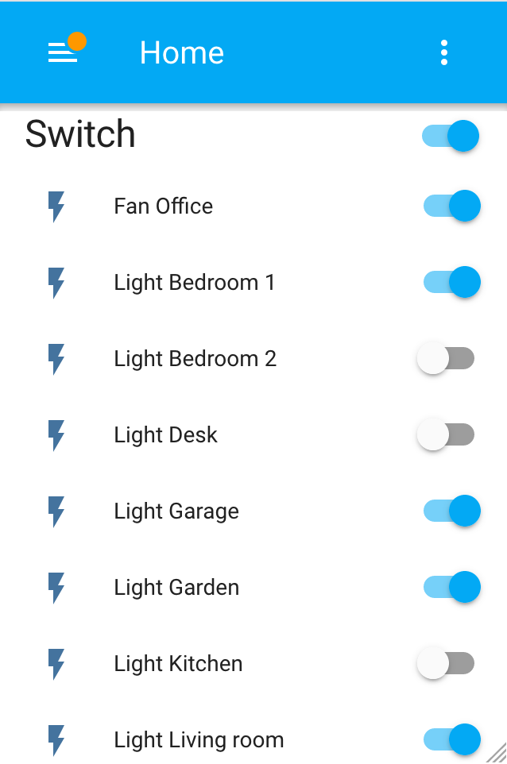
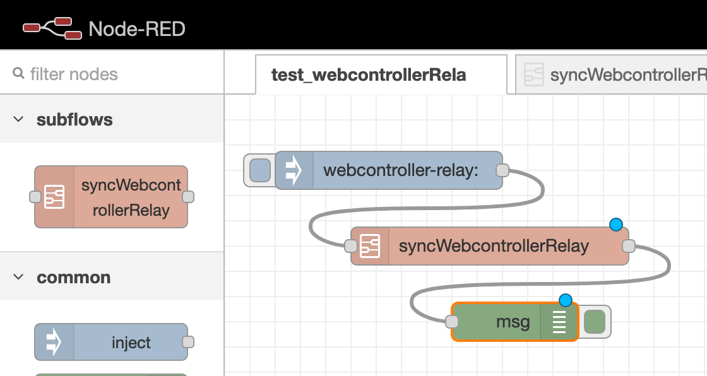
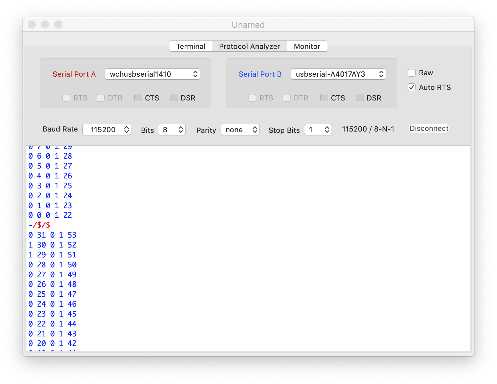

# 🚥 Wright Relay


## Slave sketch


### integrations

#### Home Assistant (hass)



##### UI Wizard setup

If the component is not embed in your HASS version,
install `http_inline` from `./hass/custom_compoenents/http_inline` to `/config/custom_compoenents/http_inline`,
then use the wizard.


##### CLI install

###### Custom component

Add the following lines into `configuration.yaml`,
and apply this template:

```yaml
switch:
  - platform: http_inline
    host: http://{host}
    relays:
      {relayId}: {friendlyName}
```

And customize:
- `{host}`: WebController IP or host
- `{relayId}`: WebController ID
- `{friendlyName}`: a free text

Example:

```yaml
switch:
  - platform: http_inline
    host: http://web
    relays:
      0: Fan Office
      1: Light Desk
      2: Light Kitchen
      3: Light Living room
      4: Light Bedroom 1
      5: Light Bedroom 2
      6: Light Garage
      7: Light Garden
```

###### Official

Add the following lines into `configuration.yaml`,
and apply this template:

```yaml
switch:
  - platform: command_line
    switches:
      {sluggedEntityId}:
        command_on: "/usr/bin/curl -X GET http://{host}/w/{relayId}/1"
        command_off: "/usr/bin/curl -X GET http://{host}/w/{relayId}/0"
        command_state: "/usr/bin/curl -X GET http://{host}/r/{relayId}"
        value_template: '{{ value.split()[0] == "1" }}'
        friendly_name: {friendlyName}
```

And customize:
- `{sluggedEntityId}`: HASS entity ID
- `{host}`: WebController IP or host
- `{relayId}`: WebController ID
- `{friendlyName}`: a free text

Example:

```yaml
switch:
  - platform: command_line
    switches:
      r0:
        command_on: "/usr/bin/curl -X GET http://webrelay.local/w/0/1"
        command_off: "/usr/bin/curl -X GET http://webrelay.local/w/0/0"
        command_state: "/usr/bin/curl -X GET http://webrelay.local/r/0"
        value_template: '{{ value.split()[0] == "1" }}'
        friendly_name: "Relay #0"
      r42:
        command_on: "/usr/bin/curl -X GET http://webrelay.local/w/42/1"
        command_off: "/usr/bin/curl -X GET http://webrelay.local/w/42/0"
        command_state: "/usr/bin/curl -X GET http://webrelay.local/r/42"
        value_template: '{{ value.split()[0] == "1" }}'
        friendly_name: "Relay #42"
```

##### NodeRed



Import the `./nodered/flows_subFlowAndTest.json` (or `flow_subFlowOnly.json`)


## Master sketch


## tools

### custom HTML

- edit ./web/html/slave.html
- export to ./sketch_WSlave/webApp-generated-*.h by `./bin/slave_html_generate.sh`
- export to ./sketch_WMaster/data/* by `./bin/master_html_generate.sh`
- export to ./sketch_WMaster/certificate-generated.h/* by `./bin/master_certificate_generate.sh`
- run `./web/docker-compose up` for testing

### docker-compose

```bash
$ ./web
$ docker-compose up
```

- test custom HTML on http://{docker-machine}:8080
- test Home Assistant on http://{docker-machine}:8123
- test NodeRed on http://{docker-machine}:1880

### help

You can watch the communication between an Arduino Mega slave and a ESP master with SerialTools.
Use a separate Wemos D1 mini and a standard Arduino Mega. 




A video explains how to upload the sketches on an Arduino Mega ESP8266
[](https://www.youtube.com/watch?v=7OckOeyoso8)

Backup a configuration into `./sketch_WMaster/dump/` with `./bin/master_config_download.sh`, 
then upload it on a fresh install with `./bin/master_config_upload.sh`.
