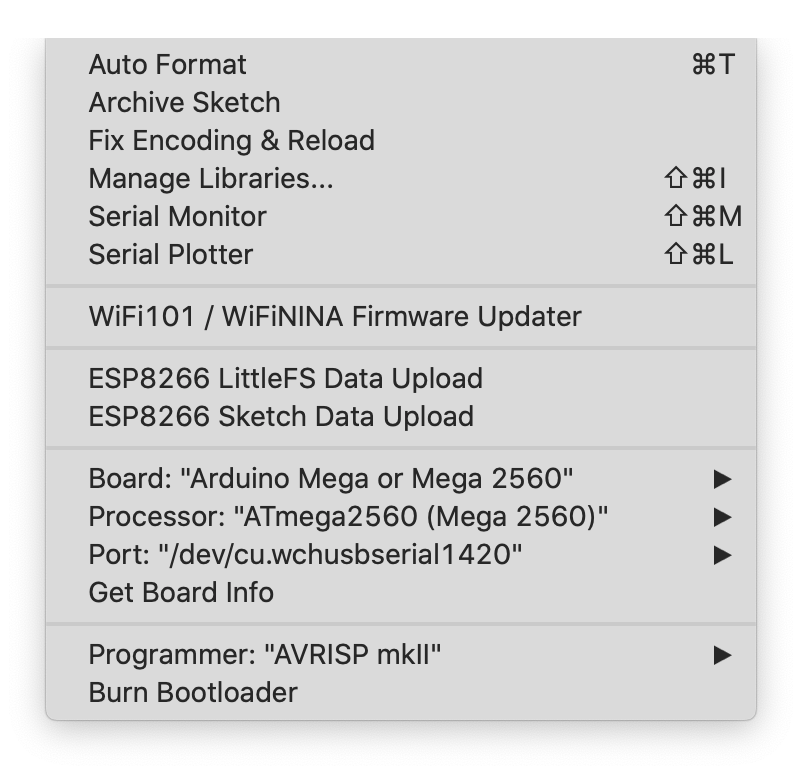
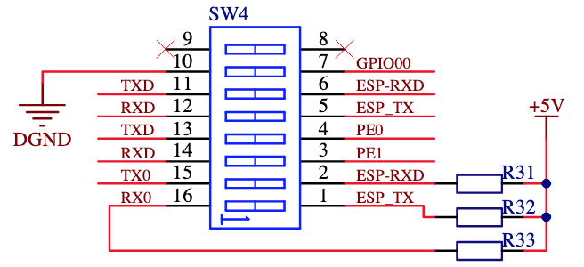
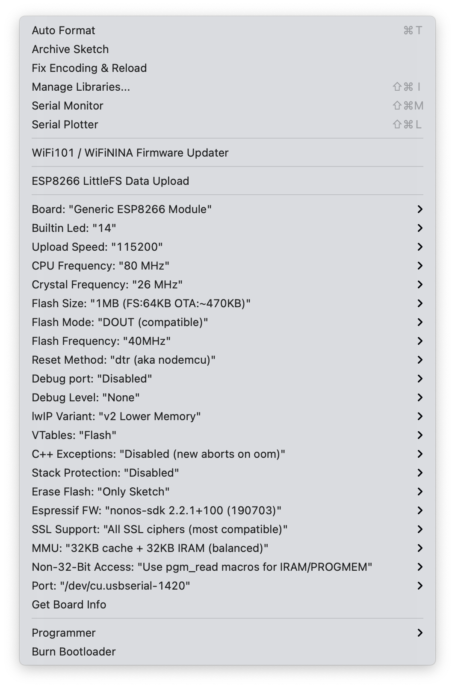

# 🚥 Wright Relay

## Slave sketch

### dependancies

#### software

- **Arduino** (for the required Slave sketch)
- *EthernetBonjour if `WS_BONJOUR_MODE` != `WS_BONJOUR_MODE_NONE`*

### upload Sketch

Open the folder ./sketch_WSlave/ with your favorite IDE (Arduino?)

Example with a Wemos Mega WiFi, a board with a Arduino Mega and an Esp8266 linked by a Serial. 
First, upload the Slave sketch on the Arduino Mega part. 

<ins>/!\\</ins> First I have to update my USB driver for this board: 

Set the switches 3-4 ON, the others ones OFF ()

## Master sketch

### dependancies

#### software

- **Esp8266**
- **ArduinoJson**
- *ESPAsyncWebServer (optional for faster HTTP server, not HTTPS)*
- *fauxmoESP (optional for Alexa)*
- *ESP AsyncTCP (optional for ESPAsyncWebServer or fauxmoESP)*

### upload Sketch

Open the folder ./sketch_WMaster/ with your favorite IDE (Arduino?)

Example with a Wemos Mega WiFi, a board with a Arduino Mega and an Esp8266 linked by a Serial. 
Then, upload the Master sketch on the Arduino ESP part. 

<ins>/!\\</ins> First I have to update my USB driver for this board: 
/

Set BUILTIN_LED on pin #14 according to [schematics](https://robotdyn.com/pub/media/0G-00005806==MEGA+WiFi-R3-AT2560-ESP8266-32MB-CH340G/DOCS/Schematic==0G-00005806==MEGA+WiFi-R3-AT2560-ESP8266-32MB-CH340G.pdf).

Set the switches 5-6-7 ON, the others ones OFF ()

Press the MODE button while the sketch is uploading. 
Close the Serial Monitor window to upload the LittleFS data. 

For the final run, 
set the switches 1-2 ON, the others ones OFF. 
It will connect the Arduino Mega part to the Arduino ESP part.
