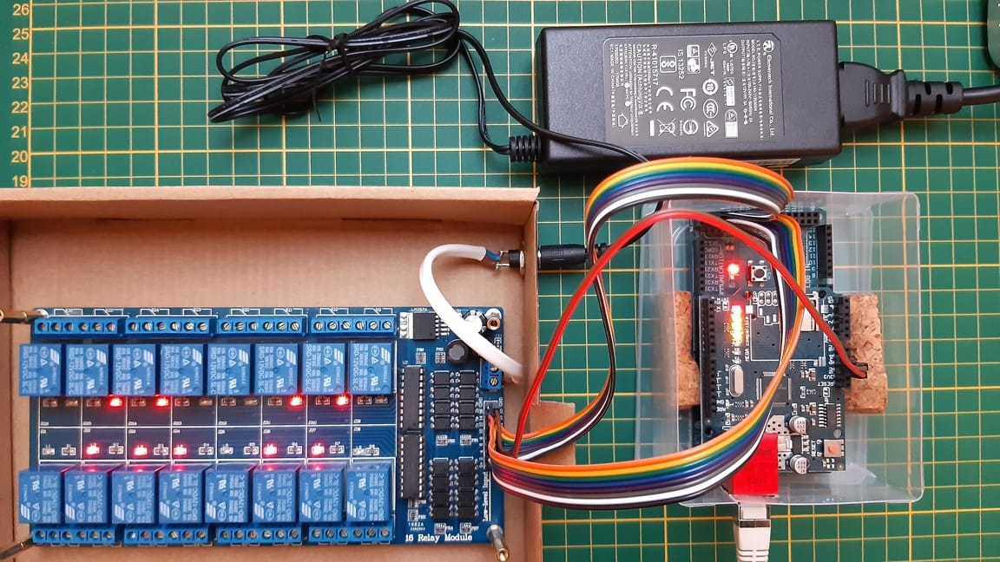
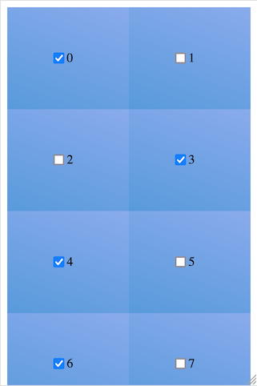
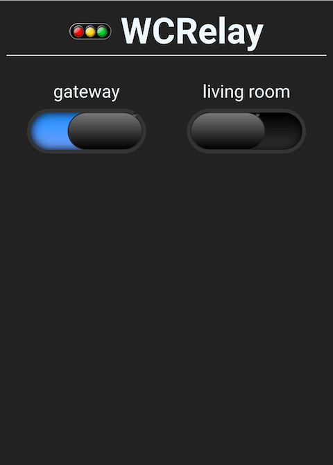
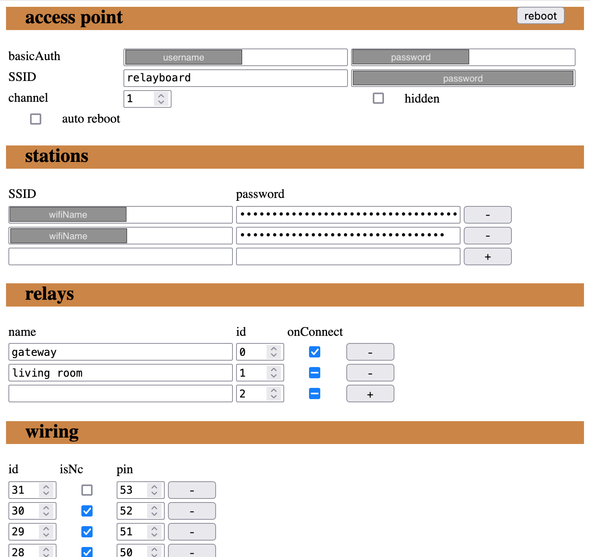

# 🚥 Wright Relay

A single controller connected by Web or USB.

This project has 2 parts:
- a [required Slave sketch](#slave-sketch) to control the relay with optional interfaces:
  - CLI
    - USB (CLI)
    - Serial (CLI)
  - API/html
    - Ethernet
    - WiFi

- an [optional Master sketch](#master-sketch) for some powerful features driven by an ESP:
  - rich configuration portal
  - relay labeling
  - switching on Hotspot connection
  - multi-WiFi
  - Alexa
  - https

[](https://www.youtube.com/watch?v=T4h35BUY_8s)


## Slave sketch

On standalone mode, you can add an Ethernet shield or a WiFi shield.


### Setup

Edit `./sketch_WSlave/_config.h`


### Commands

Standard no-REST routes:

- **?**: `/?`
  version info

- **#**: `/#`
  number of relays if `WS_VERBOSE = WS_VERBOSE_LENGTH`

- **$**: `/$`
  full status list of all pins if `WS_VERBOSE = WS_VERBOSE_LIST`

- **r**ead: `/r/{relay_id}`
  read relay state

- **w**rite: `/w/{relay_id}/{value}`
  set a state (0-1) to this relay
  (set a pin to OUTPUT mode)
  
- **R**ead: `/R/{relay_id}`
  unlock the relay and read its state if `WS_ACL_ALLOW = WS_ACL_ALLOW_LOCK`

- **W**rite: `/W/{relay_id}/{value}`
  lock the relay and force its state (0-1) if `WS_ACL_ALLOW = WS_ACL_ALLOW_LOCK`
  (set a pin to OUTPUT mode)

- **m**ap: `/m/{relay_id}/{pin_id}`
  map a relay to a pin controller

- **n**c: `/c/{relay_id}/{is_nc}`
  set a relay to NC mode (is_nc=1) or NO mode (is_nc=0)

- save (**!**): `/!`
  save the wiring into EEPROM, not the values ON/OFF if `WS_STORAGE != WS_STORAGE_NONE`

- reset (**~**): `/~`
  reset the board  if `WS_ACL_ALLOW = WS_ACL_ALLOW_RESET`

- sleep (**.**): `/.`
  sleep the board  if `WS_ACL_ALLOW = WS_ACL_ALLOW_SLEEP`

Read the 

#### Example to setup the relay #7 on the pin #42

- First, map PIN -> RELAY
- Then set the NC/NO wiring
- Last give the default value for activation

##### HTTP

- Go to `http://webrelay.local/m/7/42`
- Go to `http://webrelay.local/c/7/1` if it's a NC wired (`http://webrelay.local/c/7/0` otherwise)
- Go to `http://webrelay.local/w/7/1` if you want switch ON now (`http://webrelay.local/w/7/0`otherwise)
- Go to `http://webrelay.local/r/7` to check

##### Serial

- Send `/m/7/42`
- Send `/c/7/1` if it's a NC wired (`/o/7/0` otherwise)
- Send `/w/7/1` if you want switch ON now (`/w/7/0`otherwise)
- Send `/r/7` to check
- Tips: use `/` to wakeup


### webApp

`#define WS_INTERFACE WS_INTERFACE_ETHERNET` (or `WS_INTERFACE_ALL` by default)

The Arduino boots on the DHCP.
If `#define WS_VERBOSE WS_VERBOSE_WEBAPP` (or `WS_VERBOSE_ALL` by default),
open a bowser on `http://{ip}` (416B).




### USB

`#define WS_INTERFACE WS_INTERFACE_USB` (or `WS_INTERFACE_ALL` by default)

If `#define WS_VERBOSE WS_VERBOSE_HELP` (or `WS_VERBOSE_ALL` by default),
write anything and the read the help


### dependancies

#### software

- **Arduino** (for the required Slave sketch)
- *EthernetBonjour if `WS_BONJOUR_MODE` != `WS_BONJOUR_MODE_NONE`*


## Master sketch

It will add Relay names, Alexa features, low power consumption. The Master communicates to the Slave by the Serial interface.


### Setup

Edit `./sketch_WMaster/_config.h`


### Commands

Standard REST routes:

- `GET /api/r`
  get relay list

- `GET /api/r/{relay_id}`
  get state of a relay

- `PUT /api/r/{relay_id}`
  set state of a relay

Read the 


### webApp

Connect to "HelloWorld" WiFi (* you could change),
Open a bowser on `https://{ip}` (645B).



The config portal is on `https://{ip}/portal` (1020B / 1072B with Google addon).



The Google OAuth2 for limited-input device is on `https://{ip}/google` (301B)


### dependancies

#### software

- **Esp8266**
- **ArduinoJson** (>= 7.0.0)
- *GoogleSchedular (>= 4.1.0, optional for Google Calendar)*
- *FastTimer (>= 3.1.0, required by GoogleSchedular)*
- *ESPAsyncWebServer (optional for faster HTTP server, not HTTPS)*
- *fauxmoESP (optional for Alexa)*
- *ESP AsyncTCP (optional for ESPAsyncWebServer or fauxmoESP)*


### Suggestions

- ☑︎ DONE: read states from calendar
- ☑︎ DONE: ESP as master controller: ESP interrupts the sleeping Arduino on Serial (RX3=PCINT[9] on Mega)
- ☑︎ DONE: ESP has no preconfigured credentials (from the firmware)
- ☑︎ DONE: if the ESP cannot join a known network, it starts as hotspot during a # seconds
- ☑︎ DONE: when the ESP as hotspot has a connected client, it switch ON the relay #0 (should be the home router)

### Google Calendar

Drive your relays from a Google Calendar: name an event exactly like a relay,
and that relay turns **ON** while the event is running, then **OFF** when it
ends. The board syncs the calendar about once a minute.

#### 1. Create your Google credentials (once)

The board uses the OAuth2 *limited-input device* flow, so you only need a free
Google account:

1. Open the [Google Cloud console](https://console.cloud.google.com/) and create
   a project (e.g. `WrightRelay`).
2. On the **OAuth consent screen**, keep the project in *testing* mode and add
   your own Google account under *Test users*.
3. Under **Credentials**, create an *OAuth client ID* of type **TV and Limited
   Input devices**. Google gives you a `CLIENT_ID` and a `CLIENT_SECRET`.

Put those two values in the Master sketch config as `WS_GOOGLE_API_CLIENT_ID`
and `WS_GOOGLE_API_CLIENT_SECRET`, then flash the board.

> Details: https://developers.google.com/identity/protocols/oauth2/limited-input-device

#### 2. Pair the board (once)

1. Open the pairing page at `https://{ip}/google`. It shows a short **code**.
2. Go to https://www.google.com/device, sign in with the test account, and type
   the code.

That's it. The board stores the resulting `refresh_token` and reconnects
**silently** after every reboot — no need to pair again. If Google later revokes
the token (or it expires after the 7-day testing-mode window), the board detects
it, clears the stale token and reopens the pairing page automatically.

#### 3. Pick the calendar and name your events

In the config portal set the **calendar name** (its display name, e.g.
`ArduinoRelay`). Then create events in that calendar whose **title matches a
relay name** exactly. While such an event is running, its relay is ON.

#### API reference

Under the hood the board only reads two endpoints (minimal `fields=` payloads to
stay light on the ESP):

```
GET /calendar/v3/users/me/calendarList?fields=items(id,summary)
GET /calendar/v3/calendars/{calendarId}/events?fields=items(summary)&singleEvents=true&timeMin=...&timeMax=...
```


## more docs

- [External integrations](./doc/extra.md) (HomeAssitant, NodeRed, tools, etc)
- [All-in-One hardware](./doc/wemos-mega-wifi.md) (Arduino+ESP8266, Wemos Mega WiFi, RobotDyn, etc)