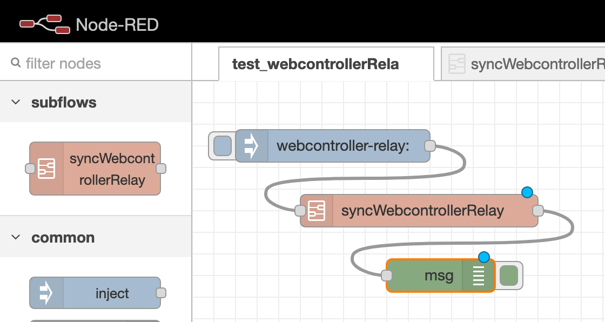

# WrightSlave Relay

A single controller connected by Web or USB.


## Setup

Edit `./sketch_WSlave/config.h`


## Commands

Standard REST routes:
- **$**: `/$`
  full status list of all pins if `#define MODE_VERBOSE MODE_VERBOSE_LIST` (or `MODE_VERBOSE_ALL` by default)

- **r**ead: `/r/{relay_id}`
  read relay state

- **w**rite: `/w/{relay_id}/{value}`
  set a state (0-1) to this relay
  (set a pin to OUTPUT mode)

- **m**ap: `/m/{relay_id}/{pin_id}`
  map a relay to a pin controller

- N**o**: `/c/{relay_id}`
  set a relay to NC mode

- N**c**: `/o/{relay_id}`
  set a relay to NO mode

- save (**!**): `/!`
  save the wiring into EEPROM, not the values ON/OFF

- reset (**~**): `/~`
  reset the board  if `#define ACL_ALLOW ACL_ALLOW_RESET` (or `ACL_ALLOW_RESET` by default)


## webApp

`#define MODE_SERIAL MODE_SERIAL_ETHERNET` (or `MODE_SERIAL_ALL` by default)

The Arduino boots on the DHCP.
If `#define MODE_VERBOSE MODE_VERBOSE_WEBAPP` (or `MODE_VERBOSE_ALL` by default),
open a bowser on `http://{ip}`.


## USB

`#define MODE_SERIAL MODE_SERIAL_USB` (or `MODE_SERIAL_ALL` by default)

If `#define MODE_VERBOSE MODE_VERBOSE_HELP` (or `MODE_VERBOSE_ALL` by default),
write anything and the read the help


## dependancies

### software

- Ethernet.h
- standard Serial (Arduino.h)


### integrations

#### Home Assistant (hass)


Install `http_plaintext` from `./doc/hass/custom_compoenents/http_plaintext` to `/config/custom_compoenents/http_plaintext`, 
then add the following lines into `configuration.yaml`

```yaml
switch:
  - platform: http_plaintext
    host: http://webrelay.local
    relays:
      0:  relayname 1
      1:  relay name 2
      2:  a relay name 3
      30: another relayname 31
      31: and this relayname 32
```

#### NodeRed



Import the `./doc/nodered/flows_subFlowAndTest.json` (or `flow_subFlowOnly.json`)


### tools

#### custom HTML

- edit ./web/html/index.html
- export to ./sketch_WSlave/_webApp.h by `./web/html2h.h`
- run `./web/docker-compose up` for testing

#### docker-compose

```bash
$ ./web
$ docker-compose up
```

- test custom HTML on http://{docker-machine}:8080
- test Home Assistant on http://{docker-machine}:8123
- test NodeRed on http://{docker-machine}:1880


#### Suggestions

TODO: read states from calendar
