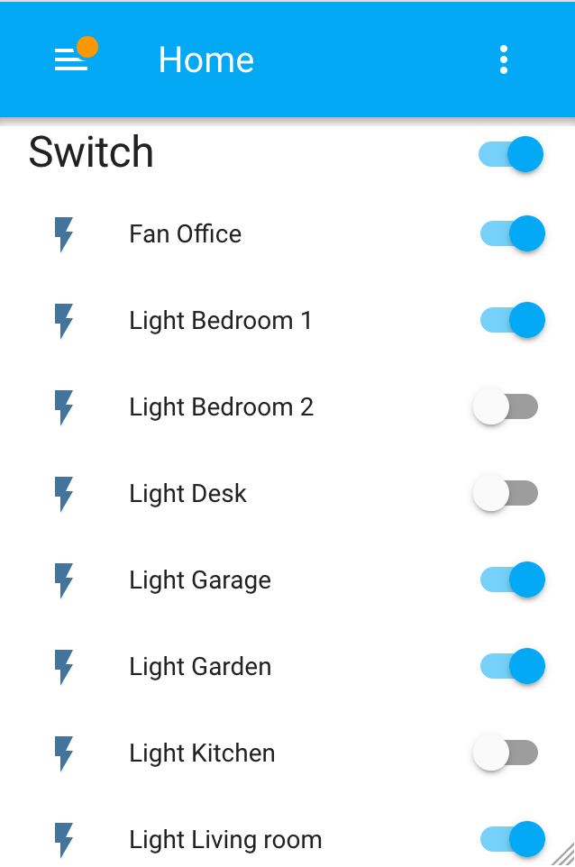

# WrightSlave Relay

A single controller connected by Web or USB.


## Setup

Edit `./sketch_WSlave/_config.h`


## Commands

Standard no-REST routes:

- **$**: `/$`
  full status list of all pins if `WS_VERBOSE = WS_VERBOSE_LIST`

- **r**ead: `/r/{relay_id}`
  read relay state

- **w**rite: `/w/{relay_id}/{value}`
  set a state (0-1) to this relay
  (set a pin to OUTPUT mode)
  
- **R**ead: `/R/{relay_id}`
  unlock the relay and read its state if `WS_ACL_ALLOW = WS_ACL_ALLOW_LOCK`

- **W**rite: `/W/{relay_id}/{value}`
  lock the relay and force its state (0-1) if `WS_ACL_ALLOW = WS_ACL_ALLOW_LOCK`
  (set a pin to OUTPUT mode)

- **m**ap: `/m/{relay_id}/{pin_id}`
  map a relay to a pin controller

- N**o**: `/c/{relay_id}`
  set a relay to NC mode

- N**c**: `/o/{relay_id}`
  set a relay to NO mode

- save (**!**): `/!`
  save the wiring into EEPROM, not the values ON/OFF if `WS_STORAGE = !WS_STORAGE_NONE`

- reset (**~**): `/~`
  reset the board  if `WS_ACL_ALLOW = WS_ACL_ALLOW_RESET`

- sleep (**.**): `/.`
  sleep the board  if `WS_ACL_ALLOW = WS_ACL_ALLOW_SLEEP`

Read the 

### Example to setup the relay #7 on the pin #42

- First, map PIN -> RELAY
- Then set the NC/NO wiring
- Last give the default value for activation

#### HTTP

- go to `http://webrelay.local/m/7/42`
- go to `http://webrelay.local/c/7` if it's a NC wired (`http://webrelay.local/o/7` otherwise)
- go to `http://webrelay.local/w/7/1` if you want switch ON now (`http://webrelay.local/w/7/0`otherwise)
- go to `http://webrelay.local/r/7` to check

#### Serial

- Send `/m/7/42`
- Send `/c/7` if it's a NC wired (`/o/7` otherwise)
- Send `/w/7/1` if you want switch ON now (`/w/7/0`otherwise)
- Send `/r/7` to check


## webApp

`#define WS_INTERFACE WS_INTERFACE_ETHERNET` (or `WS_INTERFACE_ALL` by default)

The Arduino boots on the DHCP.
If `#define WS_VERBOSE WS_VERBOSE_WEBAPP` (or `WS_VERBOSE_ALL` by default),
open a bowser on `http://{ip}`.


## USB

`#define WS_INTERFACE WS_INTERFACE_USB` (or `WS_INTERFACE_ALL` by default)

If `#define WS_VERBOSE WS_VERBOSE_HELP` (or `WS_VERBOSE_ALL` by default),
write anything and the read the help


## dependancies

### software

- EthernetBonjour if `WS_BONJOUR_MODE` != `WS_BONJOUR_MODE_NONE`


### integrations

#### Home Assistant (hass)



##### UI Wizard setup

If the component is not embed in your HASS version,
install `http_inline` from `./doc/hass/custom_compoenents/http_inline` to `/config/custom_compoenents/http_inline`,
then use the wizard.


##### CLI install

###### Custom component

Add the following lines into `configuration.yaml`,
and apply this template:

```yaml
switch:
  - platform: http_inline
    host: http://{host}
    relays:
      {relayId}: {friendlyName}
```

And customize:
- `{host}`: WebController IP or host
- `{relayId}`: WebController ID
- `{friendlyName}`: a free text

Example:

```yaml
switch:
  - platform: http_inline
    host: http://web
    relays:
      0: Fan Office
      1: Light Desk
      2: Light Kitchen
      3: Light Living room
      4: Light Bedroom 1
      5: Light Bedroom 2
      6: Light Garage
      7: Light Garden
```

###### Official

Add the following lines into `configuration.yaml`,
and apply this template:

```yaml
switch:
  - platform: command_line
    switches:
      {sluggedEntityId}:
        command_on: "/usr/bin/curl -X GET http://{host}/w/{relayId}/1"
        command_off: "/usr/bin/curl -X GET http://{host}/w/{relayId}/0"
        command_state: "/usr/bin/curl -X GET http://{host}/r/{relayId}"
        value_template: '{{ value.split()[0] == "1" }}'
        friendly_name: {friendlyName}
```

And customize:
- `{sluggedEntityId}`: HASS entity ID
- `{host}`: WebController IP or host
- `{relayId}`: WebController ID
- `{friendlyName}`: a free text

Example:

```yaml
switch:
  - platform: command_line
    switches:
      r0:
        command_on: "/usr/bin/curl -X GET http://webrelay.local/w/0/1"
        command_off: "/usr/bin/curl -X GET http://webrelay.local/w/0/0"
        command_state: "/usr/bin/curl -X GET http://webrelay.local/r/0"
        value_template: '{{ value.split()[0] == "1" }}'
        friendly_name: "Relay #0"
      r42:
        command_on: "/usr/bin/curl -X GET http://webrelay.local/w/42/1"
        command_off: "/usr/bin/curl -X GET http://webrelay.local/w/42/0"
        command_state: "/usr/bin/curl -X GET http://webrelay.local/r/42"
        value_template: '{{ value.split()[0] == "1" }}'
        friendly_name: "Relay #42"
```

#### NodeRed


Import the `./doc/nodered/flows_subFlowAndTest.json` (or `flow_subFlowOnly.json`)


### tools

#### custom HTML

- edit ./web/html/index.html
- export to ./sketch_WSlave/webApp-generated.h by `./web/html2h.h`
- run `./web/docker-compose up` for testing

#### docker-compose

```bash
$ ./web
$ docker-compose up
```

- test custom HTML on http://{docker-machine}:8080
- test Home Assistant on http://{docker-machine}:8123
- test NodeRed on http://{docker-machine}:1880


#### Suggestions

TODO: read states from calendar
TODO: ESP as master controller: ESP interrupts the sleeping Arduino on Serial (RX3=PCINT[9] on Mega)
TODO: ESP has no preconfigured credentials (from the firmware)
TODO: if the ESP cannot join a known network, it starts as hotspot during a # seconds
TODO: when the ESP as hotspot has a connected client, it switch ON the relay #0 (should be the home router)
