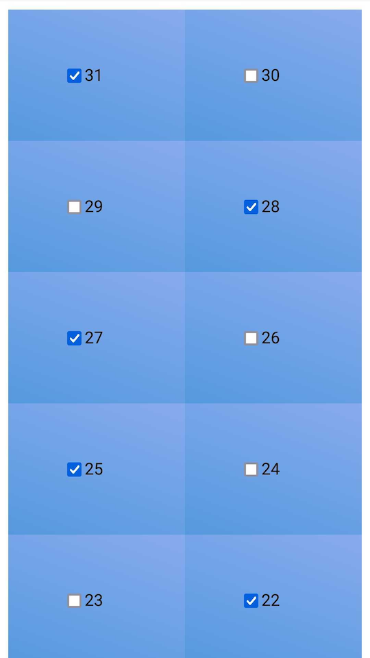

# 🚥 Wright Relay

A single controller connected by Web or USB.

This project has 2 parts:
- a [required Slave sketch](#slave-sketch) to control the relay with optional interfaces:
  - CLI
    - USB (CLI)
    - Serial (CLI)
  - API/html
    - Ethernet
    - WiFi

- an [optional Master sketch](#master-sketch) for some powerful features driven by an ESP:
  - rich configuration portal
  - relay labeling
  - switching on Hotspot connection
  - multi-WiFi
  - Alexa
  - https

## Slave sketch

On standalone mode, you can add an Ethernet shield or a WiFi shield.

### Setup

Edit `./sketch_WSlave/_config.h`

### Commands

Standard no-REST routes:

- **?**: `/?`
  version info

- **#**: `/#`
  number of relays if `WS_VERBOSE = WS_VERBOSE_LENGTH`

- **$**: `/$`
  full status list of all pins if `WS_VERBOSE = WS_VERBOSE_LIST`

- **r**ead: `/r/{relay_id}`
  read relay state

- **w**rite: `/w/{relay_id}/{value}`
  set a state (0-1) to this relay
  (set a pin to OUTPUT mode)
  
- **R**ead: `/R/{relay_id}`
  unlock the relay and read its state if `WS_ACL_ALLOW = WS_ACL_ALLOW_LOCK`

- **W**rite: `/W/{relay_id}/{value}`
  lock the relay and force its state (0-1) if `WS_ACL_ALLOW = WS_ACL_ALLOW_LOCK`
  (set a pin to OUTPUT mode)

- **m**ap: `/m/{relay_id}/{pin_id}`
  map a relay to a pin controller

- **n**c: `/c/{relay_id}/{is_nc}`
  set a relay to NC mode (is_nc=1) or NO mode (is_nc=0)

- save (**!**): `/!`
  save the wiring into EEPROM, not the values ON/OFF if `WS_STORAGE = !WS_STORAGE_NONE`

- reset (**~**): `/~`
  reset the board  if `WS_ACL_ALLOW = WS_ACL_ALLOW_RESET`

- sleep (**.**): `/.`
  sleep the board  if `WS_ACL_ALLOW = WS_ACL_ALLOW_SLEEP`

Read the 

#### Example to setup the relay #7 on the pin #42

- First, map PIN -> RELAY
- Then set the NC/NO wiring
- Last give the default value for activation

##### HTTP

- go to `http://webrelay.local/m/7/42`
- go to `http://webrelay.local/c/7/1` if it's a NC wired (`http://webrelay.local/c/7/0` otherwise)
- go to `http://webrelay.local/w/7/1` if you want switch ON now (`http://webrelay.local/w/7/0`otherwise)
- go to `http://webrelay.local/r/7` to check

##### Serial

- Send `/m/7/42`
- Send `/c/7/1` if it's a NC wired (`/o/7/0` otherwise)
- Send `/w/7/1` if you want switch ON now (`/w/7/0`otherwise)
- Send `/r/7` to check
- Tips: use `/` to wakeup

### webApp

`#define WS_INTERFACE WS_INTERFACE_ETHERNET` (or `WS_INTERFACE_ALL` by default)

The Arduino boots on the DHCP.
If `#define WS_VERBOSE WS_VERBOSE_WEBAPP` (or `WS_VERBOSE_ALL` by default),
open a bowser on `http://{ip}` (379B).

### USB

`#define WS_INTERFACE WS_INTERFACE_USB` (or `WS_INTERFACE_ALL` by default)

If `#define WS_VERBOSE WS_VERBOSE_HELP` (or `WS_VERBOSE_ALL` by default),
write anything and the read the help

### dependancies

#### software

- **Arduino** (for the required Slave sketch)
- *EthernetBonjour if `WS_BONJOUR_MODE` != `WS_BONJOUR_MODE_NONE`*

## Master sketch

It will add Relay names, Alexa features, low power consumption. The Master communicates to the Slave by the Serial interface.

### Setup

Edit `./sketch_WMaster/config.h`

### Commands

Standard REST routes:

- `GET /api/r`
  get relay list

- `GET /api/r/{relay_id}`
  get state of a relay

- `PUT /api/r/{relay_id}`
  set state of a relay

Read the 

### webApp

Connect to "HelloWorld" WiFi (* you could change),
Open a bowser on `https://{ip}` (742B).

The config portal is on `https://{ip}/portal` (1047B).

### dependancies

#### software

- **Esp8266**
- **ArduinoJson**
- *ESPAsyncWebServer (optional for faster HTTP server, not HTTPS)*
- *fauxmoESP (optional for Alexa)*
- *ESP AsyncTCP (optional for ESPAsyncWebServer or fauxmoESP)*

### Suggestions

- ☐ TODO: read states from calendar
- ☑︎ DONE: ESP as master controller: ESP interrupts the sleeping Arduino on Serial (RX3=PCINT[9] on Mega)
- ☑︎ DONE: ESP has no preconfigured credentials (from the firmware)
- ☑︎ DONE: if the ESP cannot join a known network, it starts as hotspot during a # seconds
- ☑︎ DONE: when the ESP as hotspot has a connected client, it switch ON the relay #0 (should be the home router)

## more docs

- [External integrations](./doc/extra.md) (HomeAssitant, NodeRed, tools, etc)
- [All-in-One hardware](./doc/wemos-mega-wifi.md) (Arduino+ESP8266, Wemos Mega WiFi, RobotDyn, etc)